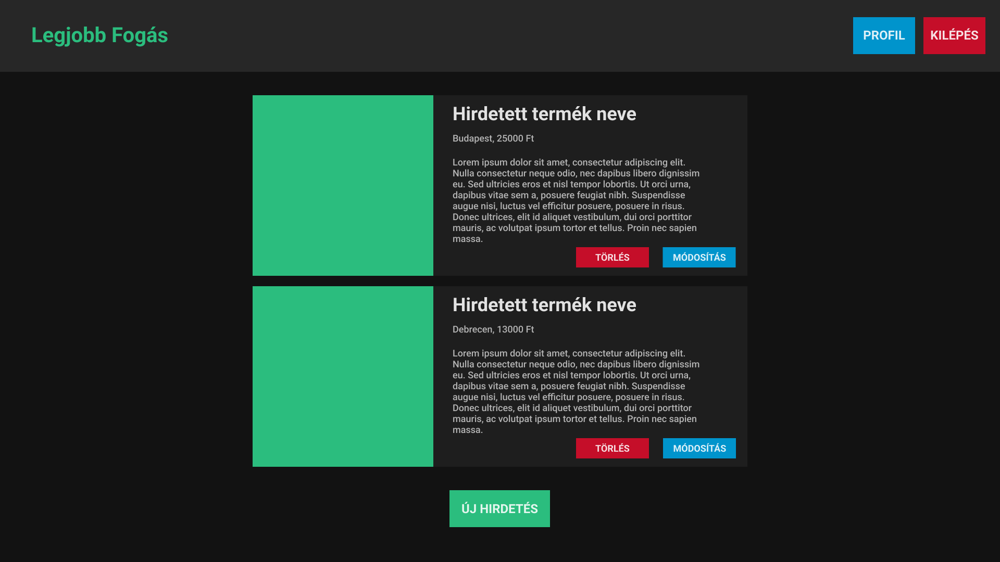

# Legjobb Fogás - Az apróhirdetési oldal (APSVTG)
*Szerver oldali JavaScript (VITMAV42) 2022 tavasz házifeladat*

## Leírás
Weboldalon a felhasználok fel adhatnak apróhirdetéseket melyben eladnak vagy vásárolnak már megunt, használt vagy akár új termékeket, szolgáltatásokat. Az oldal segít az eladónak hirdetni, a vásárlónak pedig megtalálni a megfelelő terméket.

## Funkciók
- Hirdetések listázása, megtekintése
- Új hirdetés létrehozása, módosítása, törlése
- Keresés a hirdetések között
- Kép feltöltés hirdetéshez
- Felhasználó regisztrálás, bejelentkezés, elfelejtett jelszó
- Felhasználó saját hirdetéseinek megtekintése, módosítása, törlése

## Entitások, adattagok és megvalósítandó műveletek
- Hirdetés:
    - adattagok:
        - cím
        - leírás
        - ár
        - helyszín
        - kép
    - műveletek:
        - lekérdezés
        - létrehozás
        - módosítás
        - törlés
- Felhasználó/hirdető:
    - adattagok:
        - név
        - email
        - jelszó
        - telefonszám
    - műveletek:
        - lekérdezés
        - létrehozás
        - módosítás

## Mockup és magyarázat

> Főoldal bejelentkezés nélkül: Felső sávban található egy kereső, mely segítségével a hirdetések címére tudunk szűrni. A hirdetésen található 'Részletek' gombra kattintva megnézhetjük a teljes hirdetést

> Főoldal bejelentkezés után: Felső sávban található egy kereső, mely segítségével a hirdetések címére tudunk szűrni. A hirdetésen található 'Részletek' gombra kattintva megnézhetjük a teljes hirdetést. 'Hirdetéseim' gombra kattinva megnézheti a felhasználó a saját hirdetéseit és módosíthatja is azokat. 'Profil' gombra kattintva pedig megnézheti és módosíthatja az adatait.

> Hirdetés részletei: A felhasználó láthatja a teljes hirdetést és a hirdető néhány adatát, hogy fel tudja venni vele a kapcsolatot

> Felhasználó saját hirdetései: A felhasználó láthatja a saját hirdetéseit és tudja azokat módosítani, illetve törölni. Hirdetések alatt pedig egy 'Új hirdetés' gombra kattintva létrehozhat egy új hirdetést.

> Új hirdetés: Az űrlapot kitöltve a felhasználó megadhatja a hirdetés adatait, akár képet is tölthet fel, hogy látványosabbá tegye hirdetését. Ha nem tölt fel képet, akkor egy 'placeholder' képet állít be a rendszer automatikusan.

> Hirdetés módosítása: A felhasználó módosíthatja a korábban létrehozott hirdetésének adatait. Új kép feltöltésére is van lehetősége. Ha nem szeretné elmenti a módosított adatokat akkor a 'Mégse' gombbal megteheti ezt.

> Regisztráció: Ha a felhasználó hirdetést szeretne létrehozni, ahhoz egy fiókra van szüksége, ezt a 'Regisztráció' gombbra kattintva, űrlap kitöltésével megteheti. Csak néhány adatra van szüksége: név, email, jelszó és telefonszám. Ha már létezik a megadott email címmel regisztráció, akkor a rendszer hibát dob, tehát nem lehet egy email címmel többször regisztrálni.

> Profil: A felhasználó módosíthatja a már regisztrált fiókjának adatait. Jelszó módósításra is van lehetősége azonban ekkor a jelszó és jelszó újra mezőnek egyezni kell. Ha nem szeretné elmenti a változásokat, akkor ezt a 'Mégse' gombbal megteheti.

> Bejelentkezés: Ha a felhasználó már létrehozott fiókot akkor a bejelntkezés oldalon, email címét és jelszavát helyesen megadva beléphet a fiókjába. Ha bejelöli az 'Elfelejtett jelszó' checkboxot, akkor a rendszer konzolban kiírja a felhasználó jelszavát.